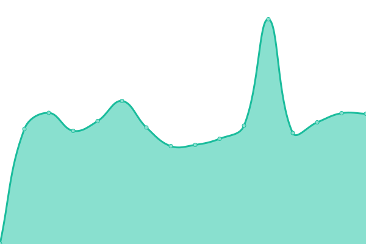

# [📈 Live Status](https://Peasisoft.github.io/upptime): <!--live status--> **🟩 All systems operational**

This repository contains the open-source uptime monitor and status page for [Peasisoft](https://peasisoft.com/), powered by [Upptime](https://github.com/upptime/upptime).

With [Upptime](https://upptime.js.org), you can get your own unlimited and free uptime monitor and status page, powered entirely by a GitHub repository. We use [Issues](https://github.com/Peasisoft/upptime/issues) as incident reports, [Actions](https://github.com/Peasisoft/upptime/actions) as uptime monitors, and [Pages](https://Peasisoft.github.io/upptime) for the status page.

<!--start: status pages-->
<!-- This summary is generated by Upptime (https://github.com/upptime/upptime) -->
<!-- Do not edit this manually, your changes will be overwritten -->
<!-- prettier-ignore -->
| URL | Status | History | Response Time | Uptime |
| --- | ------ | ------- | ------------- | ------ |
|  [Native Upsell (Offer)](https://peasisoft.com/api/popup-content?id=149&store_hash=c24b76wbe2&position=1&cartValue=0&qtyCart=0&is_has_coupons_in_cart=0&is_user_logged_in=0&user_token=&currency_code=USD) | 🟩 Up | [native-upsell-offer.yml](https://github.com/Peasisoft/upptime/commits/HEAD/history/native-upsell-offer.yml) | 

 652ms
     
 | 

<a href="https://Peasisoft.github.io/upptime/history/native-upsell-offer">100.00%</a>
    

|  [Native Recommender (Offer)](https://recommender.peasisoft.com/api/popup-content?id=165&store_hash=c24b76wbe2&position=1&currency_code=USD&screen_width=1373&is_user_logged_in=0&user_token=&type=3) | 🟩 Up | [native-recommender-offer.yml](https://github.com/Peasisoft/upptime/commits/HEAD/history/native-recommender-offer.yml) | 

 503ms
     
 | 

<a href="https://Peasisoft.github.io/upptime/history/native-recommender-offer">100.00%</a>
    

|  [Native Cart Drawer](https://nativecart.peasisoft.com/ult-upsell/login) | 🟩 Up | [native-cart-drawer.yml](https://github.com/Peasisoft/upptime/commits/HEAD/history/native-cart-drawer.yml) | 

 133ms
     
 | 

<a href="https://Peasisoft.github.io/upptime/history/native-cart-drawer">100.00%</a>
    

|  [Peasi Landing Page](https://welcome.peasisoft.com/) | 🟩 Up | [peasi-landing-page.yml](https://github.com/Peasisoft/upptime/commits/HEAD/history/peasi-landing-page.yml) | 

 596ms
     
 | 

<a href="https://Peasisoft.github.io/upptime/history/peasi-landing-page">100.00%</a>
    

<!--end: status pages-->

[**Visit our status website →**](https://Peasisoft.github.io/upptime)

## 📄 License

- Powered by: [Upptime](https://github.com/upptime/upptime)
- Code: [MIT](./LICENSE) © [Anand Chowdhary](https://anandchowdhary.com), supported by [Pabio](https://pabio.com)
- Data in the `./history` directory: [Open Database License](https://opendatacommons.org/licenses/odbl/1-0/)
