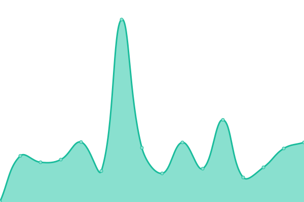

# [📈 Live Status](https://Peasisoft.github.io/upptime): <!--live status--> **🟩 All systems operational**

This repository contains the open-source uptime monitor and status page for [Peasisoft](https://peasisoft.com/), powered by [Upptime](https://github.com/upptime/upptime).

With [Upptime](https://upptime.js.org), you can get your own unlimited and free uptime monitor and status page, powered entirely by a GitHub repository. We use [Issues](https://github.com/Peasisoft/upptime/issues) as incident reports, [Actions](https://github.com/Peasisoft/upptime/actions) as uptime monitors, and [Pages](https://Peasisoft.github.io/upptime) for the status page.

<!--start: status pages-->
<!-- This summary is generated by Upptime (https://github.com/upptime/upptime) -->
<!-- Do not edit this manually, your changes will be overwritten -->
<!-- prettier-ignore -->
| URL | Status | History | Response Time | Uptime |
| --- | ------ | ------- | ------------- | ------ |
|  [Native Upsell](https://peasisoft.com/ult-upsell/login) | 🟩 Up | [native-upsell.yml](https://github.com/Peasisoft/upptime/commits/HEAD/history/native-upsell.yml) | 

 177ms
     
 | 

<a href="https://Peasisoft.github.io/upptime/history/native-upsell">100.00%</a>
    

|  [Native Recommender](https://recommender.peasisoft.com/ult-upsell/login) | 🟩 Up | [native-recommender.yml](https://github.com/Peasisoft/upptime/commits/HEAD/history/native-recommender.yml) | 

 153ms
     
 | 

<a href="https://Peasisoft.github.io/upptime/history/native-recommender">100.00%</a>
    

|  [Native Cart Drawer](https://nativecart.peasisoft.com/ult-upsell/login) | 🟩 Up | [native-cart-drawer.yml](https://github.com/Peasisoft/upptime/commits/HEAD/history/native-cart-drawer.yml) | 

 140ms
     
 | 

<a href="https://Peasisoft.github.io/upptime/history/native-cart-drawer">100.00%</a>
    

|  [Peasi Landing Page](https://welcome.peasisoft.com/) | 🟩 Up | [peasi-landing-page.yml](https://github.com/Peasisoft/upptime/commits/HEAD/history/peasi-landing-page.yml) | 

 388ms
     
 | 

<a href="https://Peasisoft.github.io/upptime/history/peasi-landing-page">100.00%</a>
    

<!--end: status pages-->

[**Visit our status website →**](https://Peasisoft.github.io/upptime)

## 📄 License

- Powered by: [Upptime](https://github.com/upptime/upptime)
- Code: [MIT](./LICENSE) © [Anand Chowdhary](https://anandchowdhary.com), supported by [Pabio](https://pabio.com)
- Data in the `./history` directory: [Open Database License](https://opendatacommons.org/licenses/odbl/1-0/)
